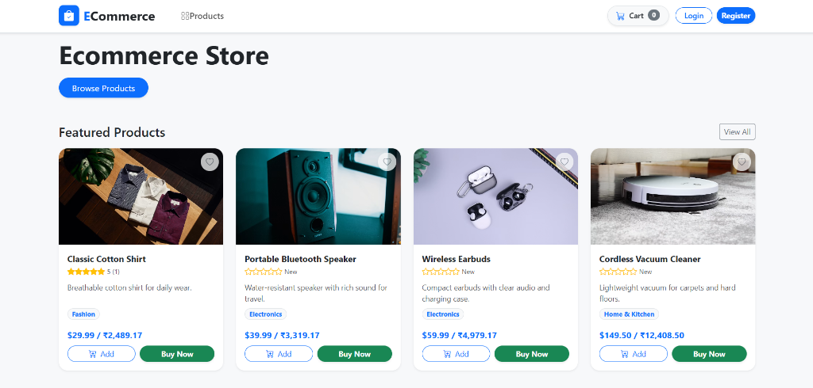
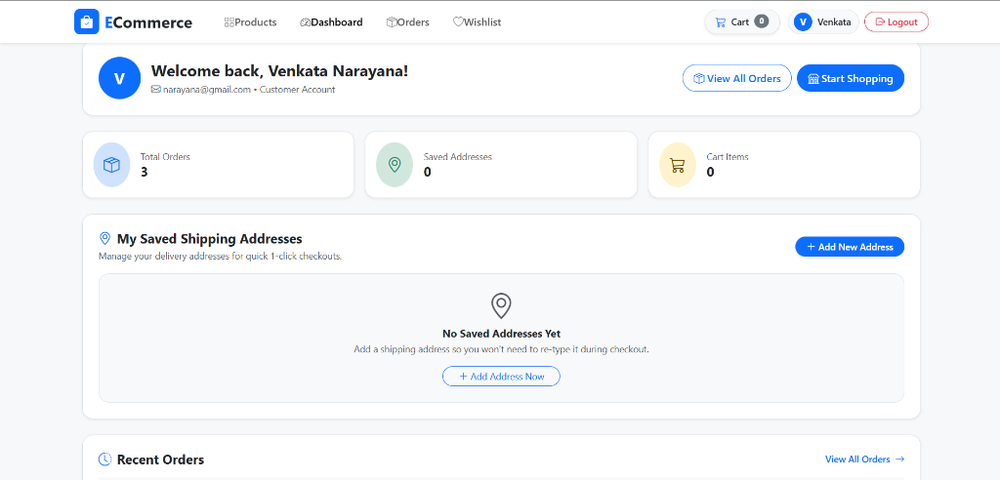
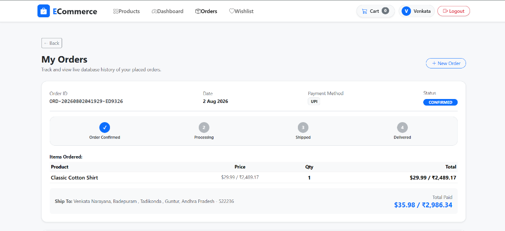
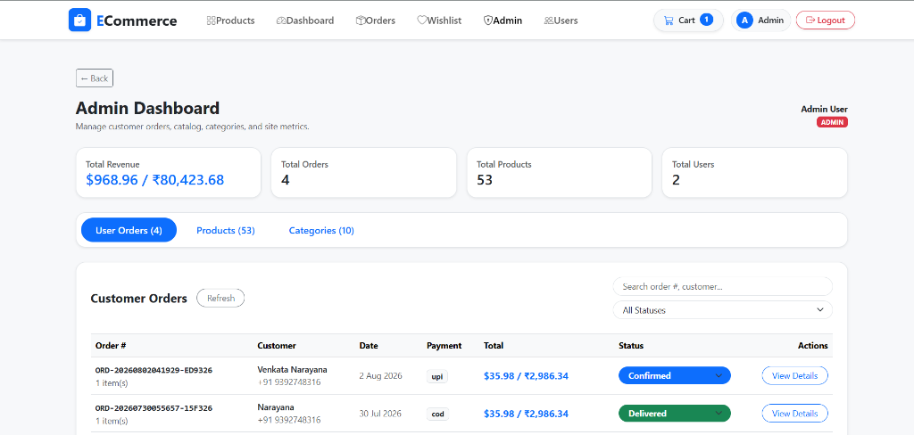
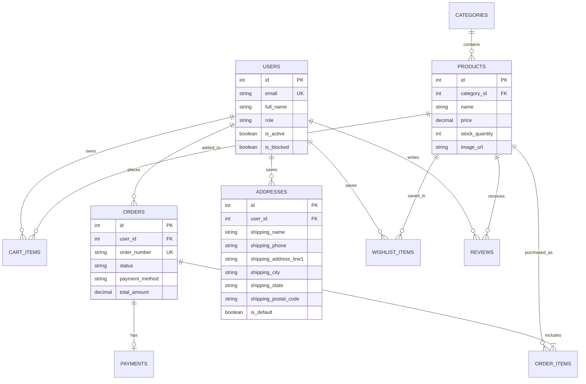

# Modern E-Commerce Platform (React + FastAPI)

A full-stack, production-ready Single Page Application (SPA) e-commerce platform built with **React 18**, **Vite 8**, **Bootstrap 5**, **FastAPI**, **SQLAlchemy 2.0**, and **PostgreSQL**.

## Application Screenshots & Previews

### Homepage & Product Catalog


### Customer Account Dashboard & Shipping Address Management


### Live Order Tracking & Order History Page


### Admin Portal & Order Fulfillment Dashboard


---

## Key Features

### Shopping & Checkout Experience
- **Direct 1-Click "Buy Now"**: Instantly proceed to checkout directly from product cards or detail pages.
- **Guest-to-User Cart Migration**: Automatically syncs guest cart items into the permanent backend database cart upon login/registration.
- **Interactive Multi-Channel Payment Gateway**:
  - **Credit / Debit Card**: Live 3D visual credit card preview with real-time formatting.
  - **UPI (Unified Payments Interface)**: Simulated QR code auto-generator and VPA validation.
  - **Net Banking**: Bank grid selector (HDFC, SBI, ICICI, Axis, Kotak).
  - **Cash on Delivery (COD)**.
  - **Simulated Gateway Processing**: 3-stage interactive status overlay (`Connecting` → `Authorizing` → `Approved`).

### Customer Profile & Order Tracking
- **Saved Shipping Addresses Hub**: Persists delivery addresses in the database (`addresses` table) with `DEFAULT` badge, default selection, and modal creation form.
- **Live Visual Order Tracking Timeline**: Real-time progress timeline on the Orders page (`Order Confirmed` → `Processing` → `Shipped` → `Delivered`).
- **Customer Dashboard**: Central account hub displaying user profile, saved address management, and recent order history preview.

### Ratings, Reviews & Wishlist
- **Product Ratings & Customer Reviews**: 1-5 star ratings summary (`★★★★☆`) and customer review submission form, saved directly in the database (`reviews` table).
- **Database Wishlist / Favorites**: Heart toggle buttons on product cards and product details with a dedicated Wishlist management page.

### Admin Management Portal
- **Dashboard Metrics**: Platform metrics overview (Revenue, Total Orders, Active Users, Products).
- **Order Fulfillment**: Review customer orders and update shipping status (`Processing`, `Shipped`, `Delivered`).
- **Product Catalog Management**: Add, update, or remove products and set stock quantities.
- **User Access Control**: Manage customer accounts and toggle active/blocked access flags.

---

## Technology Stack

### Frontend
- **Core**: React 18, Vite 8, JavaScript (ES6+)
- **Routing**: React Router v6 (Public, ProtectedRoute, AdminRoute)
- **Styling**: Bootstrap 5.3, Bootstrap Icons CDN (Vector SVG Icons)
- **Typography**: Google Fonts (Inter)
- **State Management**: React Context API (`AuthContext`, `CartContext`)
- **HTTP Client**: Axios with JWT Bearer token interceptor

### Backend
- **Framework**: Python 3.12, FastAPI 0.110+
- **ORM**: SQLAlchemy 2.0 (Declarative Base, Mapped type annotations, joinedload, func)
- **Database Migrations**: Alembic
- **Authentication**: JWT (JSON Web Tokens), Passlib (Bcrypt password hashing)
- **ASGI Server**: Uvicorn

### Database
- **Primary Database**: PostgreSQL (Neon Cloud Database) / SQLite fallback capability

---

## Entity Relationship (ER) Diagram



---

## API Endpoint Registry

| Method | Endpoint | Description | Auth Required |
| :--- | :--- | :--- | :---: |
| `POST` | `/api/auth/register` | Register new customer account | No |
| `POST` | `/api/auth/login` | Authenticate user & return JWT token | No |
| `GET` | `/api/auth/me` | Fetch current user profile | Yes |
| `GET` | `/api/products` | List product catalog with search & filters | No |
| `GET` | `/api/products/{id}` | Fetch single product details | No |
| `GET` | `/api/cart` | Fetch current user's cart items | Yes |
| `POST` | `/api/cart` | Add item to cart | Yes |
| `GET` | `/api/addresses` | List saved shipping addresses | Yes |
| `POST` | `/api/addresses` | Add new shipping address to DB | Yes |
| `GET` | `/api/wishlist` | Fetch saved wishlist products | Yes |
| `POST` | `/api/wishlist/{product_id}` | Toggle item in wishlist | Yes |
| `GET` | `/api/products/{id}/reviews` | Fetch customer reviews for product | No |
| `POST` | `/api/products/{id}/reviews` | Submit 1-5 star rating and comment | Yes |
| `POST` | `/api/orders` | Checkout & create order | Yes |
| `GET` | `/api/orders` | Fetch user order history | Yes |
| `GET` | `/api/admin/summary` | Platform performance metrics | Admin |
| `PUT` | `/api/admin/orders/{id}/status` | Update order status | Admin |

---

## Quick Start & Local Setup

### Prerequisites
- **Node.js** (v18+)
- **Python** (v3.12+)

### 1. Backend Setup (FastAPI)
```bash
# Navigate to backend directory
cd backend

# Create virtual environment
python -m venv .venv

# Activate virtual environment (Windows)
.\.venv\Scripts\activate

# Install dependencies
pip install -r requirements.txt

# Start FastAPI development server
uvicorn app.main:app --reload --host 127.0.0.1 --port 8000
```

### 2. Frontend Setup (React + Vite)
```bash
# Navigate to frontend directory
cd frontend

# Install dependencies
npm install

# Start Vite dev server
npm run dev
```

---

## License
This project is open-source and available under the **MIT License**.
