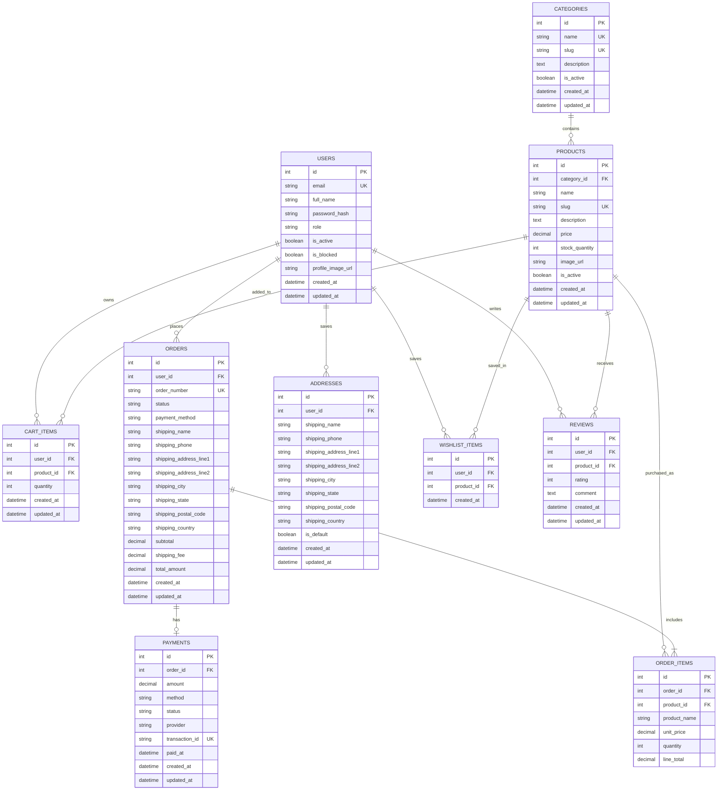

# Ecommerce ER Diagram

## Relationships

- One user can have many saved addresses, cart items, wishlist items, reviews, and orders.
- One category can contain many products.
- One product can appear in many carts, wishlist items, reviews, and order items.
- One order has many order items.
- One order has zero or one payment record.
